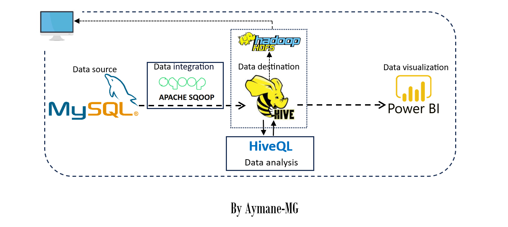
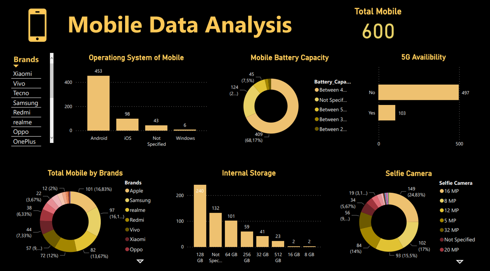

# Mobile-Data-Hive-Insights


## Table of Contents
1. [Project Overview](#project-overview)
3. [Technologies Used](#technologies-used)
4. [Data Pipeline](#data-pipeline)
5. [Repository Structure](#repository-structure)
6. [How to Run](#how-to-run)
7. [Dashboard](#dashboard)
8. [Acknowledgments](#acknowledgments)
9. [Conclusion](#conclusion)
10. [Contacts](#contacts)


## Project Overview

This project demonstrates the process of extracting data from a MySQL database, transferring it using Apache Sqoop, storing it in Hive Data warehouse (the data actually is store in Hadoop Distributed File System (HDFS)), and performing analysis using Hive Query Language (Hive QL) (it is a language close to SQL). Then visualize the data  in Power BI, after connecting the hive datawarehouse to power BI.


## Technologies Used

`MySQL Database`: Used as the source database from which data was extracted.

`Apache Sqoop`: Utilized for transferring data between MySQL and the Hadoop ecosystem. Batch integration mode was used for importing data from MySQL to Hive datawarehouse.

`Apache Hive`: Employed as the datawarehouse solution in this project, also for data processing and analysis using Hive Query Language(HiveQL).

`Apache Derby`:   used as embedded database for storing the Hive Metastore.

`Hadoop Ecosystem (HDFS)`: the data, stored in hive datawarehouse, is actually stored in Hadoop Distributed File System (HDFS).

`Power BI`: Used for creating interactive visualization and dashboard.


## Data Pipeline
Here is the data pipeline :



## Repository Structure

```batch
Mobile-Data-Hive-Insights:.
│   README.md
│
├───dashboard
│       mobile_dash.pbix
│       mobile_dash.pdf
│
├───dataset
│       Mobile_Data.csv
│
├───hive_sqoop
│       hive_statements.sh
│       import_data_with_sqoop.sh
│
└───images
        dashboard_mobile.png
        data_pipeline.png
```

## How to Run

#### Prerequisites

- MySQL Database: Ensure you have the necessary access rights to the database containing the source data. (import the data from the csv file into mysql database)
- Apache Sqoop: Install and configure Apache Sqoop for data transfer between MySQL and hive datawarehouse.
- Hadoop: Set up Hadoop cluster and configure HDFS for data storage.
- Apache Hive: Install Hive for data analysis.
- Power BI: Install Power BI for creating the dashboard.


#### Running

   - Start the Hadoop cluster using the following commands:
     ```
     start-dfs
     start-yarn
     ```

   - Start the Apache Derby server using the command:
     ```
     StartNetWorkServer -h 0.0.0.0
     ```
   - Launch Hive using the command:
     ```
     hive
     ```
   - Open a new command line window as an Administrator and run the following Sqoop command to import data from MySQL to the Hive table:
   ```
   sqoop import --connect jdbc:mysql://localhost:3306/<mysql_database_name> --username <your_username> --password <your_password> --table <mysql_table_name> --hive-import --hive-table <hive_table> --create-hive-table --m 1
   ```

   Note: Replace `<mysql_database_name>`, `<your_username>`, `<your_password>`, `<mysql_table_name>`, and `<hive_table>` with appropriate values.

Check for any errors during the data import process. If there are no errors, congratulations!:) The data has been successfully imported into the Hive data warehouse.


#### Building the Dashboard:

   - Launch Power BI and connect to the Hive data source to access the imported data.

   - Build interactive visualization, charts, and graphs based on the imported data.(or you can directly open the provided `.pbix` file)


With these steps completed, you have successfully set up the project, imported data from MySQL to the Hive data warehouse, and created interactive dashboards using Power BI. Enjoy exploring your data and gaining valuable insights!


## Dashboard

Here is the  Dashboard created in Power BI:




# Acknowledgments
- Special thanks to the open-source communities behind `hadoop ecosystem` , and  `Power BI`.

# Conclusion
this project seamlessly integrated MySQL data into the Hadoop ecosystem using Apache Sqoop and Hive, enabling efficient analysis and visualization through Power BI. The successful collaboration of these technologies highlights the project's effectiveness in transforming raw data into actionable insights, emphasizing the power of unified data solutions in modern analytics.

# Contacts
For any questions or further information, feel free to contact me :)

- **linkedin**: <a href="https://www.linkedin.com/in/aymane-maghouti/" target="_blank">Aymane Maghouti</a><br>
- **Email**: `aymanemaghouti@gmail.com`
